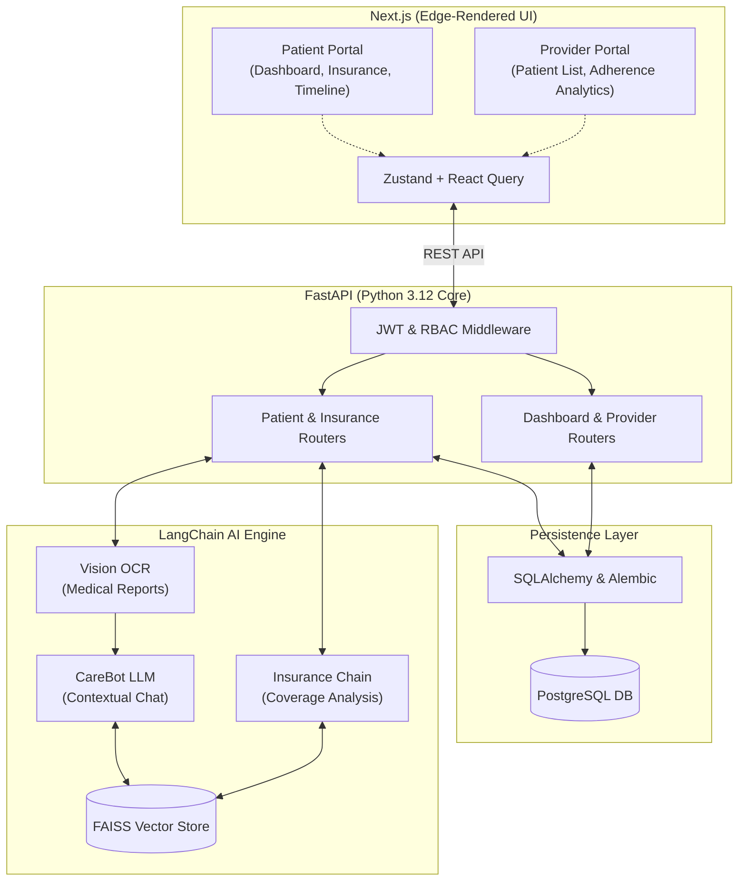

<p align="center">
  
</p>

<h1 align="center">CareFlow</h1>

<p align="center">
  <strong>Your Intelligent, Real-Time AI Health Companion</strong><br>
  <em>Built to revolutionize personal health management through AI-driven insights.</em>
</p>

<p align="center">
  <a href="https://github.com/AshrafGalaxy/CareFlow/blob/main/LICENSE"></a>
  <a href="https://nextjs.org/"></a>
  <a href="https://fastapi.tiangolo.com/"></a>
  <a href="https://python.org/"></a>
</p>

---

## 🚀 The Vision

**CareFlow** is a modern, privacy-focused health management platform designed for the future. Built from the ground up for our hackathon presentation, CareFlow centralizes your medical timeline, analyzes complex medical reports using AI OCR, tracks medication adherence in real-time, and provides an active AI companion (CareBot) to answer your health queries based *strictly* on your actual medical history.

### 🔴 The Problem
Modern healthcare data is heavily fragmented. Patients struggle to understand complex medical terminology in their lab reports, frequently miss critical medication doses, and lack a centralized timeline of their own health history. This leads to anxiety, poor adherence, and a disconnect between doctor visits.

### 🟢 The CareFlow Solution
CareFlow bridges the gap between clinical data and patient comprehension. By leveraging Large Language Models (LLMs) and advanced OCR, we translate raw medical data into actionable, easy-to-understand insights—all accessible via an interactive, gamified dashboard.

---

## 📸 Sneak Peek
> *(Tip for hackathon: Insert a GIF or screenshot of your dashboard here!)*
<p align="center">
  
</p>

---

## ✨ Key Innovations

- 🤖 **Interactive AI CareBot:** A vectorized, physics-based companion that lives natively on your dashboard. It doesn't just chat; it holds context of your entire medical timeline, providing instant, personalized health insights.
- 📄 **Smart Report Analyzer:** Upload PDFs or images of blood tests or medical reports. The built-in Vision OCR and LLM pipeline automatically extracts key metrics, flags abnormal values, and suggests critical follow-up questions for your next doctor's appointment.
- ⏱️ **Unified Health Timeline:** A chronologically generated, highly interactive visualization of your past appointments, uploaded reports, and medication histories. Never lose track of a diagnosis again.
- 💊 **Medication Adherence Tracking:** Real-time charting to track daily pill intake alongside visual indicators and alert systems for missed doses.
- 🔒 **Zero-Trust Security Layer:** Health data requires the utmost privacy. We built a fully fledged JWT authentication and Role-Based Access Control (RBAC) system to protect highly sensitive records.

---

## 🏗️ Technical Architecture

CareFlow uses a decoupled, highly scalable microservice architecture. It combines a lightning-fast Edge-rendered frontend with a heavy-lifting Python AI backend.



---

## 💻 Tech Stack

| Category | Technologies Used |
| :--- | :--- |
| **Frontend UI/UX** | Next.js 14, React, Tailwind CSS, Shadcn UI, Framer Motion |
| **State Management**| Zustand, React Query |
| **Backend API** | Python 3.12, FastAPI, Pydantic |
| **AI & NLP** | LangChain, FAISS Vector Store, Multi-modal OCR |
| **Database & ORM** | PostgreSQL (Dockerized), SQLite, SQLAlchemy, Alembic |

---

## 🛠️ Getting Started (Local Development)

Want to run CareFlow locally? Follow these steps to get the microservices up and running.

### Prerequisites
- Node.js >= 18.x
- Python >= 3.10
- Docker Desktop (for Postgres)

### 1. Clone the Repository
```bash
git clone https://github.com/AshrafGalaxy/CareFlow.git
cd CareFlow
```

### 2. Backend Setup
```bash
# Set up the python virtual environment
python -m venv venv
source venv/Scripts/activate # On Windows

# Install requirements
cd backend
pip install -r requirements.txt

# Start the FastAPI Server (runs on http://localhost:8000)
uvicorn main:app --reload --port 8000
```

### 3. Frontend Setup
```bash
# Install dependencies
cd frontend
npm install

# Start the Next.js development server (runs on http://localhost:3000)
npm run dev
```

### 4. Dockerized Database (Optional)
If you wish to run the full stack with a production-grade PostgreSQL instance locally:
```bash
docker-compose up -d
```

---

## 👥 Meet the Team

Built with ❤️ by passionate developers aiming to revolutionize digital health.

<table align="center">
  <tr>
    <td align="center">
      <a href="https://github.com/sharayu-ctrl">
        
      </a>
      <br />
      <sub><b>Sharayu</b></sub>
    </td>
    <td align="center">
      <a href="https://github.com/Shweta-sketch52">
        
      </a>
      <br />
      <sub><b>Shweta</b></sub>
    </td>
    <td align="center">
      <a href="https://github.com/ronitjain7">
        
      </a>
      <br />
      <sub><b>Ronit</b></sub>
    </td>
    <td align="center">
      <a href="https://github.com/AshrafGalaxy">
        
      </a>
      <br />
      <sub><b>Ashraf</b></sub>
    </td>
  </tr>
</table>

---

## 📄 License

Distributed under the MIT License. See `LICENSE` for more information.
