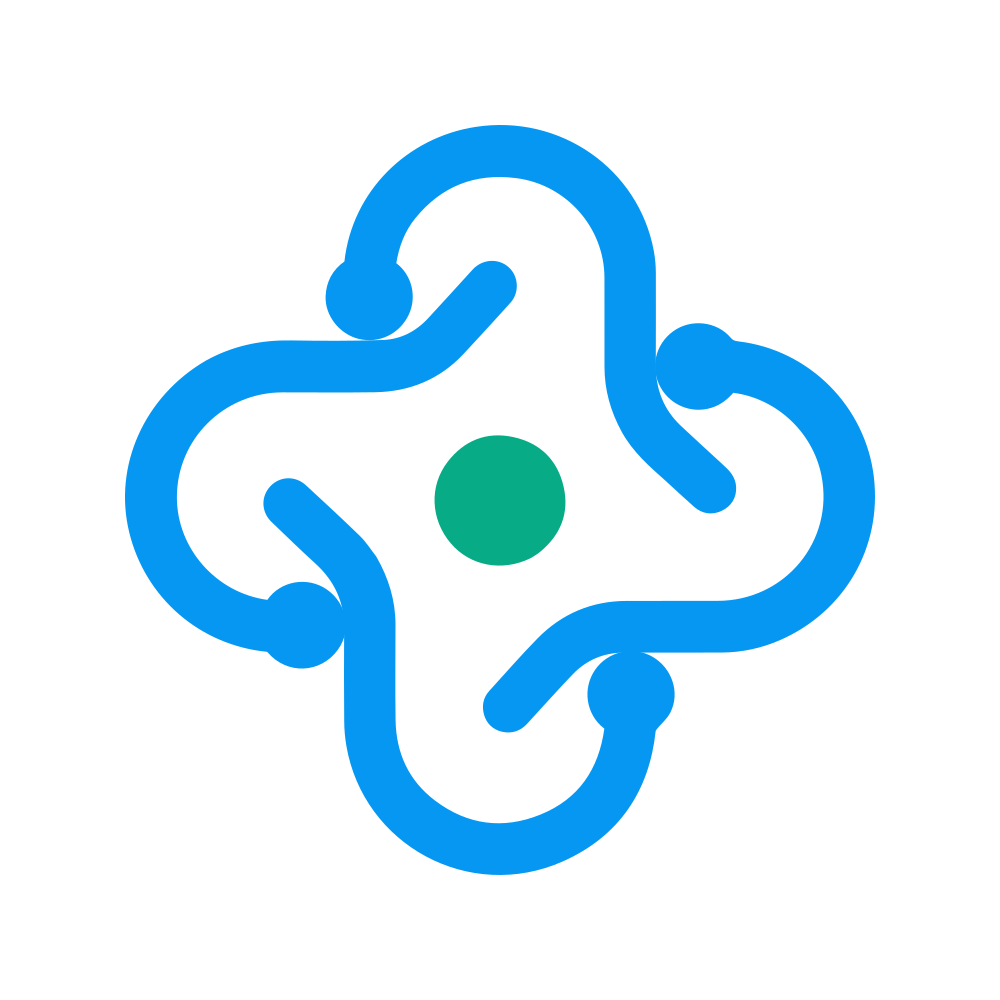
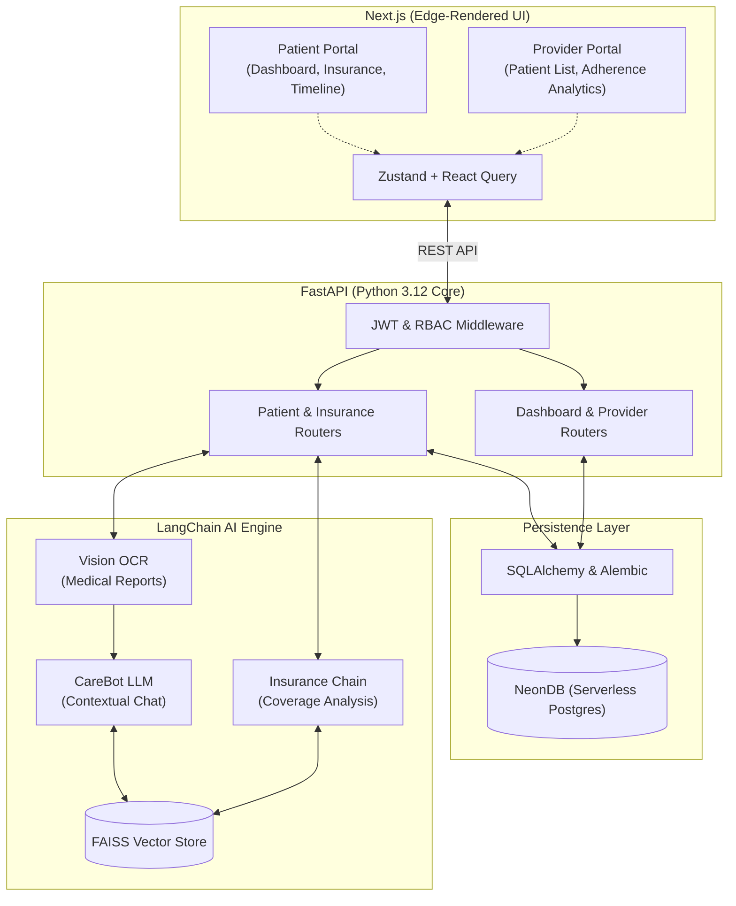

<p align="center">
  
</p>

<h1 align="center">CareFlow</h1>

<p align="center">
  <strong>Your Intelligent, Real-Time AI Health Companion</strong><br>
  <em>Built to revolutionize personal health management through AI-driven insights.</em>
</p>

<p align="center">
  <a href="https://github.com/AshrafGalaxy/CareFlow/blob/main/LICENSE"></a>
  <a href="https://nextjs.org/"></a>
  <a href="https://fastapi.tiangolo.com/"></a>
  <a href="https://neon.tech/"></a>
  <a href="https://groq.com/"></a>
  <a href="https://cloudinary.com/"></a>
</p>

---

## 🚀 The Vision

**CareFlow** is a modern, privacy-focused health management platform designed for the future. Built from the ground up for our hackathon presentation, CareFlow centralizes your medical timeline, analyzes complex medical reports using AI OCR, tracks medication adherence in real-time, and provides an active AI companion (CareBot) to answer your health queries based *strictly* on your actual medical history.

### 🔴 The Problem
Modern healthcare data is heavily fragmented. Patients struggle to understand complex medical terminology in their lab reports, frequently miss critical medication doses, and lack a centralized timeline of their own health history. This leads to anxiety, poor adherence, and a disconnect between doctor visits.

### 🟢 The CareFlow Solution
CareFlow bridges the gap between clinical data and patient comprehension. By leveraging Large Language Models (LLMs) and advanced OCR, we translate raw medical data into actionable, easy-to-understand insights—all accessible via an interactive, gamified dashboard connecting patients directly to their healthcare providers in real-time.

---

## ✨ Key Innovations & Features

- **Dual-Sided Real-Time Portal:** 
  - 🧑‍💼 **Patients:** Can request appointments, view assigned medications with adherence charting, and interact with their AI CareBot.
  - 👨‍⚕️ **Doctors:** Can approve/decline appointments instantly, view detailed patient profiles, and dynamically prescribe medications that instantly sync to the patient's dashboard.
- 🤖 **Interactive AI CareBot:** A vectorized, physics-based companion that lives natively on your dashboard. It doesn't just chat; it holds context of your entire medical timeline, providing instant, personalized health insights.
- 📄 **Smart Report Analyzer:** Upload PDFs or images of blood tests or medical reports. The built-in Vision OCR (powered by Groq) and LLM pipeline automatically extracts key metrics, flags abnormal values, and suggests critical follow-up questions for your next doctor's appointment.
- ⏱️ **Unified Health Timeline:** A chronologically generated, highly interactive visualization of your past appointments, uploaded reports, and medication histories. Never lose track of a diagnosis again.
- 🔔 **Web Push Notifications:** Real-time VAPID-based push notifications ensure patients never miss a medication dose and doctors are instantly alerted of new appointment requests.
- 🔒 **Zero-Trust Security Layer:** Health data requires the utmost privacy. We built a fully fledged JWT authentication and Role-Based Access Control (RBAC) system to protect highly sensitive records.

---

## 🏗️ Technical Architecture

CareFlow uses a decoupled, highly scalable microservice architecture. It combines a lightning-fast Edge-rendered frontend with a heavy-lifting Python AI backend.


```mermaid
graph TD
    subgraph Frontend ["Next.js (Edge-Rendered UI)"]
        direction TB
        PatientUI["Patient Portal<br/>(Dashboard, Insurance, Timeline)"]
        ProviderUI["Provider Portal<br/>(Patient List, Adherence Analytics)"]
        State["Zustand + React Query"]
        PatientUI -.-> State
        ProviderUI -.-> State
    end

    subgraph Backend ["FastAPI (Python 3.12 Core)"]
        direction TB
        Auth["JWT & RBAC Middleware"]
        API_Patient["Patient & Insurance Routers"]
        API_Provider["Dashboard & Provider Routers"]
        Auth --> API_Patient
        Auth --> API_Provider
    end

    subgraph AI_Engine ["LangChain AI Engine"]
        direction TB
        OCR["Vision OCR<br/>(Medical Reports)"]
        Bot["CareBot LLM<br/>(Contextual Chat)"]
        InsuranceAI["Insurance Chain<br/>(Coverage Analysis)"]
        VectorDB[("FAISS Vector Store")]
        
        OCR --> Bot
        Bot <--> VectorDB
        InsuranceAI <--> VectorDB
    end

    subgraph Database ["Persistence Layer"]
        direction TB
        NeonDB[("NeonDB (Serverless Postgres)")]
        ORM["SQLAlchemy & Alembic"]
        ORM --> NeonDB
    end

    %% Flow connections
    State <-->|REST API| Auth
    API_Patient <--> OCR
    API_Patient <--> InsuranceAI
    API_Patient <--> ORM
    API_Provider <--> ORM
```

---

## 💻 Tech Stack

| Category | Technologies Used |
| :--- | :--- |
| **Frontend UI/UX** | Next.js 14, React, Tailwind CSS, Shadcn UI, Framer Motion |
| **State Management**| Zustand, React Query |
| **Backend API** | Python 3.12, FastAPI, Pydantic |
| **AI & NLP** | Groq (Llama 3 / Qwen Vision), LangChain, FAISS Vector Store |
| **Database & ORM** | NeonDB (PostgreSQL), SQLAlchemy, Alembic Migrations |
| **Cloud Services** | Cloudinary (File Storage), Web Push (VAPID) |

---

## ⚙️ Environment Variables Setup

To run CareFlow locally, you must configure the environment variables for the backend. Create a `.env` file inside the `backend/` directory with the following keys:

```env
# Database Configuration (We recommend NeonDB for serverless Postgres)
DATABASE_URL=postgresql://[user]:[password]@[neon_hostname]/[dbname]?sslmode=require

# Security
SECRET_KEY=your_super_secret_jwt_key_here

# AI & LLM (Groq)
GROQ_API_KEY=your_groq_api_key_here

# Cloudinary (For Medical Report PDF/Image Uploads)
CLOUDINARY_CLOUD_NAME=your_cloud_name
CLOUDINARY_API_KEY=your_api_key
CLOUDINARY_API_SECRET=your_api_secret

# Web Push Notifications (Generate via `vapid --generate`)
VAPID_PRIVATE_KEY=your_vapid_private_key
VAPID_SUBJECT=mailto:admin@yourdomain.com
```

---

## 🛠️ Getting Started (Local Development)

Want to run CareFlow locally? Follow these steps to get the microservices up and running.

### Prerequisites
- Node.js >= 18.x
- Python >= 3.10

### 1. Clone the Repository
```bash
git clone https://github.com/AshrafGalaxy/CareFlow.git
cd CareFlow
```

### 2. Backend & Database Setup
CareFlow uses **Alembic** to manage database migrations. Make sure your `DATABASE_URL` is set in the `.env` file first.

```bash
# Set up the python virtual environment
cd backend
python -m venv venv

# Activate on Windows:
.\venv\Scripts\activate
# Activate on Mac/Linux:
source venv/bin/activate

# Install requirements
pip install -r requirements.txt

# Initialize the Database Schema (CRITICAL STEP)
alembic upgrade head

# Start the FastAPI Server (runs on http://localhost:8000)
uvicorn main:app --reload --port 8000
```

### 3. Frontend Setup
Open a new terminal window:
```bash
# Install dependencies
cd frontend
npm install

# Start the Next.js development server (runs on http://localhost:3000)
npm run dev
```

---

## 👥 Meet the Team

Built with ❤️ by passionate developers aiming to revolutionize digital health.

<table align="center" border="0" cellspacing="0" cellpadding="20">
  <tr border="0">
    <td align="center" border="0">
      <a href="https://github.com/sharayu-ctrl">
        
      </a>
      <br />
      <sub><b>Sharayu</b></sub>
    </td>
    <td align="center" border="0">
      <a href="https://github.com/Shweta-sketch52">
        
      </a>
      <br />
      <sub><b>Shweta</b></sub>
    </td>
    <td align="center" border="0">
      <a href="https://github.com/ronitjain7">
        
      </a>
      <br />
      <sub><b>Ronit</b></sub>
    </td>
    <td align="center" border="0">
      <a href="https://github.com/AshrafGalaxy">
        
      </a>
      <br />
      <sub><b>Ashraf</b></sub>
    </td>
  </tr>
</table>

---

## 📄 License

Distributed under the MIT License. See `LICENSE` for more information.
